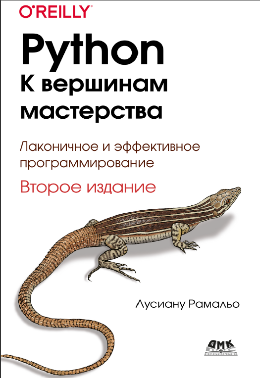

# fluent_python

### Справочные материалы для чтения книги:
### Л. Рамальо. Python - к вершинам мастерства.

Данные материалы приведены исключительно с целью тестирования 
примеров, приведенных в книге, а также для отработки гипотез, 
которые возникают при чтении книги.

